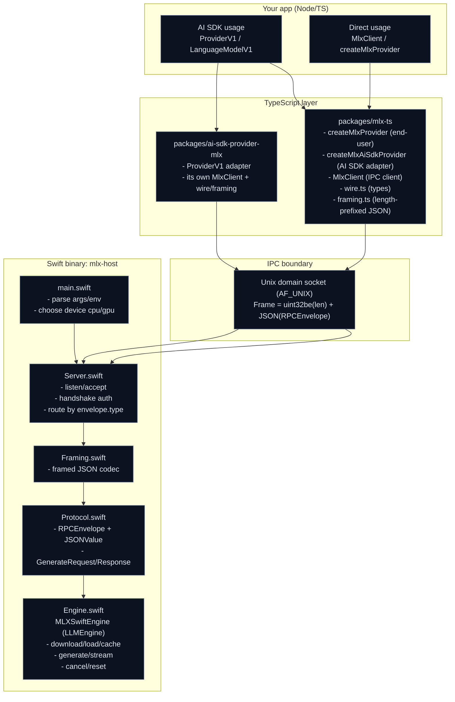
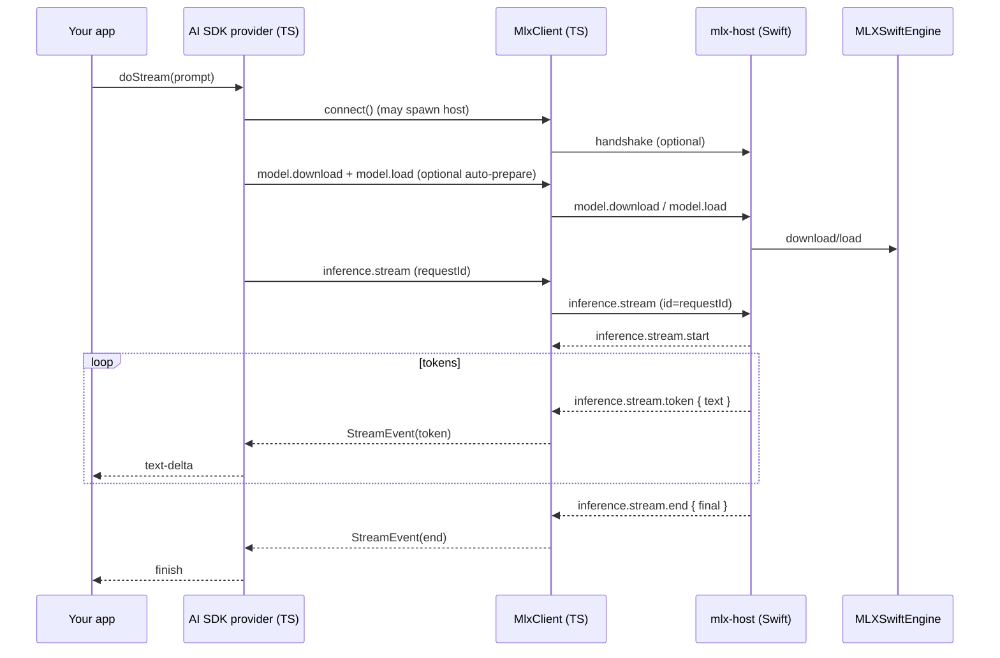

## mlx-ts

Local LLM inference on macOS using a **Swift MLX host process** + a **TypeScript client / AI SDK provider**.

### Quickstart (end users)

**Requirements**

- macOS **Apple Silicon** (`darwin/arm64`)
- Node.js

**Install**

```bash
npm i mlx-ts
```

During install, `mlx-ts` downloads a prebuilt `mlx-host` (Swift) binary + `mlx.metallib` from GitHub Releases (no Xcode required).

**Use with the AI SDK**

```ts
import { createMlxProvider } from "mlx-ts";
import { generateText, streamText } from "ai";

const modelId = "mlx-community/Llama-3.2-3B-Instruct-4bit";

const mlx = createMlxProvider({
  model: modelId,
  // optional:
  // modelsDir: "/path/to/your/models-cache",
  // hostPath: process.env.MLX_HOST_BIN,
});

const model = mlx.languageModel(modelId);

// stream
const s = await streamText({
  model,
  messages: [{ role: "user", content: "Say hello from a local MLX model." }],
});
for await (const chunk of s.textStream) process.stdout.write(chunk);
process.stdout.write("\n");

// one-shot
const g = await generateText({
  model,
  messages: [{ role: "user", content: "Summarize MLX in one sentence." }],
});
console.log(g.text);
```

**What happens on first run**

- The model is downloaded from Hugging Face into a cache directory (default: an OS cache dir; override with `modelsDir` or `MLX_MODELS_DIR`).
- `mlx-host` is started as a long-lived process and your app talks to it over a Unix domain socket (fast IPC).

### Packages

- `packages/mlx-host`: Swift executable that exposes a low-latency Unix socket RPC API (framed JSON) for model lifecycle + streaming generation.
- `packages/mlx-ts`: Core TypeScript client (`MlxClient`) + wire/framing + a built-in AI SDK adapter (`createMlxAiSdkProvider`) and end-user helper (`createMlxProvider`).
- `packages/ai-sdk-provider-mlx`: Standalone AI SDK custom provider wrapper package (built on its own `MlxClient`).

### Status

This repo includes a working Swift engine (`MLXSwiftEngine`) built on `MLXLMCommon` that supports **model download**, **load/unload**, and **streaming generation**.

### Runtime configuration

- **Force CPU vs GPU**: set `MLX_HOST_DEVICE=cpu` (default is `gpu`).
- **Override host binary**: set `MLX_HOST_BIN=/path/to/mlx-host` or pass `{ hostPath }` to `createMlxProvider`.
- **Override where models are cached**: pass `{ modelsDir }` to `createMlxProvider`.
- **Override where `mlx-ts` downloads assets from**: set `MLX_TS_HOST_BASE_URL` (should point to a directory or base URL containing `mlx-host` and `mlx.metallib`).

### OpenCode integration (Qwen3 Coder via MLX)

OpenCode supports **OpenAI-compatible providers** and lets you override any provider’s `baseURL` ([OpenCode Providers](https://opencode.ai/docs/providers/#lm-studio)). `mlx-ts` ships a tiny OpenAI-compatible local server you can use with OpenCode.

1) Start the local server:

```bash
mlx-ts-opencode --model mlx-community/Qwen3-Coder-30B-A3B-Instruct-4bit --port 3755
```

2) Generate an `opencode.json` snippet:

```bash
mlx-ts-opencode --print-config --model mlx-community/Qwen3-Coder-30B-A3B-Instruct-4bit --port 3755 > opencode.json
```

3) In OpenCode, select the model (provider/model format is `provider_id/model_id`, see [OpenCode Models](https://opencode.ai/docs/models/)):

- `mlx/qwen3-coder-mlx`

If you prefer to manage credentials in OpenCode, run `/connect` → **Other** → provider id `mlx` → any api key (it won’t be used if you set `options.apiKey` in the config).

### Architecture (one page)



#### Public TS APIs (practical view)

- **`packages/mlx-ts`**
  - `createMlxProvider({ model, modelsDir?, hostPath?, inheritStdio? })`: “batteries included” provider scoped to a single model id.
  - `MlxClient`: low-level client (connect/spawn host, model management, generate, stream, cancel, reset).
  - `wire.ts`: `GenerateRequest`, `GenerateResponse`, `StreamEvent`, `RPCEnvelope`, …
  - `framing.ts`: encode/decode length-prefixed JSON frames.
- **`packages/ai-sdk-provider-mlx`**
  - AI SDK `ProviderV1` adapter that maps AI SDK prompts → `GenerateRequest` and consumes `StreamEvent`s.

#### RPC message protocol (Swift routes by `RPCEnvelope.type`)

All messages are framed as: **`uint32be(bodyLength)` + `body`**, where body is JSON for:

`RPCEnvelope = { id?: string, type: string, payload?: any }`

| Category | Request `type` | Response / events `type` | Notes |
|---|---|---|---|
| Auth | `handshake` | `handshake.ok` or `error` | Required if `MLX_HOST_AUTH_TOKEN` is set |
| Model | `model.download` | `model.download.ok` | Downloads from Hugging Face or registers a local path |
| Model | `model.load` | `model.load.ok` | Loads model into memory |
| Model | `model.unload` | `model.unload.ok` | Unloads model from memory |
| Model | `model.delete` | `model.delete.ok` | Deletes cached model files (if known) |
| Model | `model.list` | `model.list.ok` | Returns `{ cached: string[], loaded: string[] }` |
| Inference | `inference.generate` | `inference.generate.ok` | One-shot response |
| Inference | `inference.stream` | `inference.stream.start` / `inference.stream.token`* / `inference.stream.end` / `inference.stream.error` | Streaming is a sequence of events sharing the same `id` |
| Inference | `inference.cancel` | `inference.cancel.ok` | Cancels a running stream/generation |
| System | `reset` | `reset.ok` | Unload all and optionally clear cache |
| Error | *(any)* | `error` | Payload: `{ code, message }` |

#### Streaming sequence (end-to-end)



### Development (building `mlx-host`)

If you’re hacking on the Swift host, build via `xcodebuild` (this ensures Metal shaders are produced):

```bash
cd packages/mlx-host
xcodebuild build -scheme mlx-host -destination 'platform=macOS' -configuration Debug

DD=$(ls -td ~/Library/Developer/Xcode/DerivedData/mlx-host-* | head -n 1)
export MLX_HOST_BIN="$DD/Build/Products/Debug/mlx-host"
```


